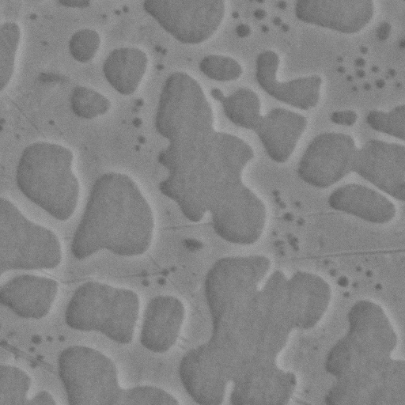
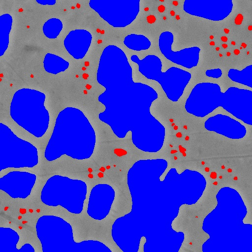
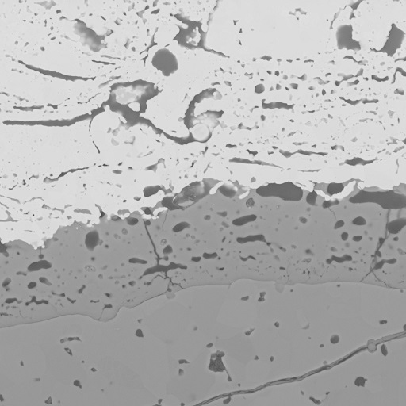

# pretrained_microscopy_models

Software tools to build deep learning microscopy segmentation and analysis models with less training data. Pretrained MicroNet encoders are available for download. Leverages transfer learning from classification models trained on a large (>100,000 images) dataset of microscopy images. <br>
## References
The paper is available [here](https://www.nature.com/articles/s41524-022-00878-5). </br>
A presentation of the work is available [here on YouTube](https://www.youtube.com/watch?v=5k2BVkfPNVI).

## Instalation:
1. First install [PyTorch](https://pytorch.org/).
2. Install this pretrained_microscopy_models with the following command.
```bash
pip install git+https://github.com/nasa/pretrained-microscopy-models
````
If you have any trouble see requirements_frozen.txt for the environment that worked for me on Windows (and a similar environment was used successfully on Linux).

## How load pretrained classification model
```python
import torch
import pretrained_microscopy_models as pmm
import torch.utils.model_zoo as model_zoo

model = torch.hub.load('pytorch/vision:v0.10.0', 'resnet50', pretrained=False)
url = pmm.util.get_pretrained_microscopynet_url('resnet50', 'microscopynet')
model.load_state_dict(model_zoo.load_url(url))
model.eval()  # <- MicrosNet model for classifcation or transfer learning
```
[This example](examples/classification_models_example.ipynb) provides shows how to download and apply a MicroNet pretrained  model for classification (after demonstrating the same for an ImageNet model for comparison). 

## How to use pretrained encoders for semantic segmentation
```python
import pretrained_microscopy_models as pmm

# setup a UNet model with a ResNet50 backbone.
model = pmm.segmentation_training.create_segmentation_model('Unet', 'resnet50', 'micronet', classes=3)

# See examples to train and make predictions with model.
```
[This example](examples/multiclass_segmentation_example.ipynb)  demonstrates how to use a pretrained model in a segmentation model through transfer learning. </br></br>

## Share micrographs to improve MicroNet
Any micrographs you can share to improve MicroNet would be greatly appreciated. Anything marked confidential in the comments will not be shared (and only used to train better encoders). You can group images in folders named after the material type and we can also make use of unlabelled micrographs. Thank you! </br>
Link: https://nasagov.app.box.com/f/f505f4652ffc4a1788e630282c5f8e58

## Benchmark datasets:
#### Ni-based superalloys (Super 1-4 in paper)
 

#### Environmental barrier coatings (EBC 1-3 in paper)
 . <br>
Note: Annotated images appear black because the annotation pixel values are 0 (background), 1 (oxide), and 2 (crack) out of 255 possible values.

## Available pretrained encoders

### MicroNet v1.1
This model was retrained. The code will default to the latest version.

| **encoder**         | **acc1** | **acc5** |
|---------------------|----------|----------|
| resnet50            | 76.630   | 94.667   |

### MicroNet v1.0
This was the version used in the paper. These encoders were randomly initialized and then pretrained on MicroNet. The table shows the top 1 and top 5 classification accuracy for each model on MicroNet.

| **encoder**         | **acc1** | **acc5** |
|---------------------|----------|----------|
| densenet121         | 88.148   | 98.963   |
| densenet161         | 87.815   | 99.074   |
| densenet169         | 89.333   | 99.222   |
| densenet201         | 88.407   | 99.074   |
| dpn107              | 84.556   | 98       |
| dpn131              | 84.593   | 98.296   |
| dpn68               | 77.741   | 94.815   |
| dpn68b              | 69       | 88.704   |
| dpn92               | 74.185   | 91.815   |
| dpn98               | 85.519   | 98.407   |
| efficientnet-b0     | 83.926   | 97.444   |
| efficientnet-b1     | 84.111   | 97.815   |
| efficientnet-b2     | 84.63    | 98.111   |
| efficientnet-b3     | 84.889   | 97.667   |
| efficientnet-b4     | 84.519   | 97.185   |
| efficientnet-b5     | 83.148   | 97.074   |
| inceptionresnetv2   | 90.926   | 99.296   |
| inceptionv4         | 93.63    | 99.704   |
| mobilenet_v2        | 83.815   | 97.815   |
| resnet101           | 77.296   | 94.704   |
| resnet152           | 85.63    | 98.185   |
| resnet18            | 79.815   | 95.667   |
| resnet34            | 77.259   | 94.444   |
| resnet50            | 62.037   | 83.741   |
| resnext101_32x8d    | 87.556   | 99.037   |
| resnext50_32x4d     | 69.037   | 89.296   |
| se_resnet101        | 93.37    | 99.741   |
| se_resnet152        | 92.926   | 99.852   |
| se_resnet50         | 93.222   | 99.741   |
| se_resnext101_32x4d | 93.889   | 99.815   |
| se_resnext50_32x4d  | 93.741   | 99.852   |
| senet154            | 94.037   | 99.741   |
| vgg11_bn            | 76.815   | 93.296   |
| vgg13_bn            | 77.889   | 93.704   |
| vgg16_bn            | 71.481   | 90.926   |
| xception            | 93.815   | 99.63    |

### ImageNet --> MicroNet v1.0
These encoders were pretrained on ImageNet and then finetuned on MicroNet
| **encoder**         | **acc1** | **acc5** |
|---------------------|----------|----------|
| densenet121         | 81.185   | 96.704   |
| densenet161         | 85.963   | 98.111   |
| densenet169         | 83.815   | 97.963   |
| densenet201         | 83.741   | 97.593   |
| dpn107              | 86.185   | 98.444   |
| dpn131              | 82.778   | 97.074   |
| dpn68               | 65.889   | 87.259   |
| dpn68b              | 52.148   | 77.519   |
| dpn92               | 69.778   | 89.333   |
| dpn98               | 84.037   | 97.556   |
| efficientnet-b0     | 92.815   | 99.778   |
| efficientnet-b1     | 93.259   | 99.741   |
| efficientnet-b2     | 93.741   | 99.889   |
| efficientnet-b3     | 93.889   | 99.741   |
| efficientnet-b4     | 94.519   | 99.741   |
| efficientnet-b5     | 93.926   | 99.778   |
| efficientnet-b6     | 92.593   | 99.556   |
| efficientnet-b7     | 92.63    | 99.63    |
| inceptionresnetv2   | 92.148   | 99.63    |
| inceptionv4         | 93.741   | 99.815   |
| mobilenet_v2        | 80.556   | 96.037   |
| resnet101           | 86.259   | 98.222   |
| resnet152           | 85.111   | 97.296   |
| resnet18            | 81.185   | 96.926   |
| resnet34            | 90.185   | 99.222   |
| resnet50            | 90.259   | 99       |
| resnext101_32x8d    | 92.815   | 99.778   |
| resnext50_32x4d     | 91.148   | 99.407   |
| se_resnet101        | 93.185   | 99.778   |
| se_resnet152        | 93.444   | 99.778   |
| se_resnet50         | 93.222   | 99.741   |
| se_resnext101_32x4d | 94.519   | 99.852   |
| se_resnext50_32x4d  | 93.63    | 99.815   |
| senet154            | 93.741   | 99.815   |
| vgg11_bn            | 89.148   | 98.889   |
| vgg11               | 1.37     | 4.556    |
| vgg13_bn            | 90.63    | 99.481   |
| vgg13               | 2        | 7.407    |
| vgg16_bn            | 90.222   | 99.37    |
| xception            | 93.444   | 99.741   |
